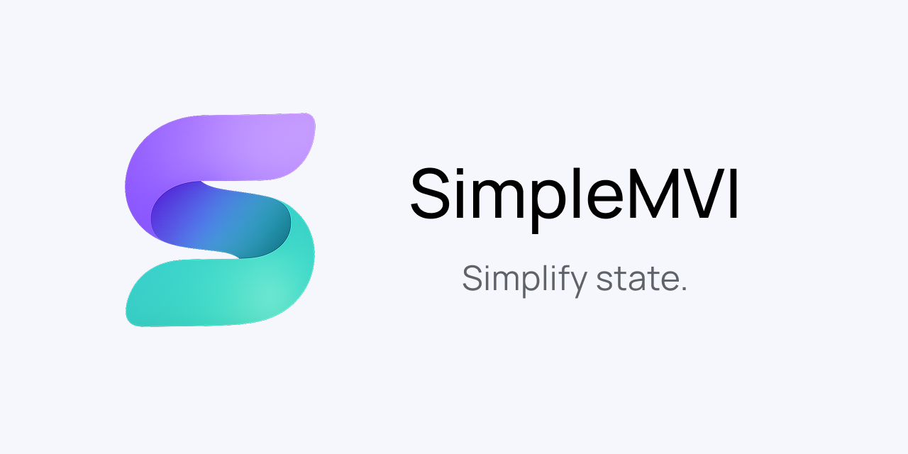

<p align="center">
  
</p>

[](https://github.com/v1rus-dev/SimpleMVI/actions/workflows/gradle.yml)
[](https://central.sonatype.com/search?q=g%3Aio.github.v1rus-dev)
[](LICENSE)
[](https://kotlinlang.org)
[](https://www.jetbrains.com/compose-multiplatform/)


SimpleMVI is a small Kotlin Multiplatform library for building explicit MVI-style state containers.

It provides a minimal set of contracts for **state**, **intent**, and **effect**, plus Compose Multiplatform helpers for lifecycle-aware effect collection and ViewModel integration.

This is intentionally a simple implementation. It does not force a classic MVI reducer, action pipeline, middleware, or store framework. You handle intents in `onIntent`, update state with `updateState`, and emit one-time effects when needed.

## Why SimpleMVI

- Immutable UI state through `StateFlow`.
- One public input for UI actions: `onIntent(intent)`.
- One-time UI events through a separate effects flow.
- No required reducer or middleware layer.
- Works without Compose, but includes Compose Multiplatform helpers.
- Small enough to use for screen ViewModels and shared app-level stores.

## Installation

- Latest version: see the Maven Central badge above.
- Group ID: `io.github.v1rus-dev`
- Core module: `simple-mvi-core`
- Compose Multiplatform module: `simple-mvi-compose`
- Android helpers module: `simple-mvi-android`

<details open>
<summary>Version catalog</summary>

```toml
[versions]
simplemvi = "<latest-version>"

[libraries]
# Core MVI contracts and state container
simplemvi-core = { module = "io.github.v1rus-dev:simple-mvi-core", version.ref = "simplemvi" }

# Compose Multiplatform ViewModel and effect collection helpers
simplemvi-compose = { module = "io.github.v1rus-dev:simple-mvi-compose", version.ref = "simplemvi" }

# Android-only lifecycle and SavedStateHandle helpers
simplemvi-android = { module = "io.github.v1rus-dev:simple-mvi-android", version.ref = "simplemvi" }
```

</details>

<details>
<summary>Gradle DSL</summary>

```kotlin
repositories {
    google()
    mavenCentral()
}

dependencies {
    implementation("io.github.v1rus-dev:simple-mvi-core:<latest-version>")

    // Compose Multiplatform helpers
    implementation("io.github.v1rus-dev:simple-mvi-compose:<latest-version>")

    // Android-only helpers, including SavedStateHandle support
    implementation("io.github.v1rus-dev:simple-mvi-android:<latest-version>")
}
```

</details>

## Modules

| Module | Target | Use it for |
| --- | --- | --- |
| `simple-mvi-core` | Android, iOS | MVI contracts, state holder, and effect flow. |
| `simple-mvi-compose` | Android, iOS | Compose Multiplatform `MviViewModel` and effect collection. |
| `simple-mvi-android` | Android | Android lifecycle helpers and `SavedStateHandle` extension. |

## Core Concepts

Every SimpleMVI feature uses the same three contracts:

```kotlin
import io.github.v1rusdev.simplemvi.core.EffectUi
import io.github.v1rusdev.simplemvi.core.IntentUi
import io.github.v1rusdev.simplemvi.core.StateUi

data class ProfileState(
    val name: String = "Jon Doe",
    val isRefreshing: Boolean = false,
) : StateUi

sealed interface ProfileIntent : IntentUi {
    data object RefreshClick : ProfileIntent
    data object BackClick : ProfileIntent
}

sealed interface ProfileEffect : EffectUi {
    data object NavigateBack : ProfileEffect
    data class ShowMessage(val text: String) : ProfileEffect
}
```

- `StateUi` is durable UI state and should be renderable at any time.
- `IntentUi` is a user or UI action.
- `EffectUi` is a one-time event such as navigation, snackbar, toast, or dialog.

## Global Observability

The hooks are global and process-wide. Configure them once during application startup — from your `Application`, or from the platform entry point in shared code — when you want to log or analyze every observed intent and effect.

```kotlin
import io.github.v1rusdev.simplemvi.core.MviConfig

MviConfig.configure {
    onIntent { intent ->
        println("SimpleMVI intent: $intent")
    }
    onEffect { effect ->
        println("SimpleMVI effect: $effect")
    }
    onError { error ->
        println("SimpleMVI hook failed: $error")
    }
}
```

`configure {}` merges into the current configuration: only the hooks you set inside the block are replaced, the others keep their previous value. Use `MviConfig.reset()` to drop every hook at once, including in tests.

Hooks are observability only and must never break the store they observe:

- An exception thrown by `onIntent` or `onEffect` is caught and routed to `onError` instead of propagating into the intent or effect path. An exception thrown by `onError` itself is ignored.
- `onEffect` fires only for effects the effect flow accepted. A `tryEmitEffect` that returns `false` dropped the effect, and no hook is notified for it. Acceptance is not delivery, though: when nothing is collecting `uiEffects` — for example while the screen is stopped — the effect is still accepted, then discarded, and the hook does fire.

`MviViewModel` and `BaseMviStore` notify the intent hook before calling your `handleIntent` implementation. A class that delegates to `createStore(...)` and overrides `onIntent` itself owns that path and takes over the notification — see [Store Delegation](#store-delegation).

## Compose ViewModel

Use `MviViewModel` when a Compose screen owns its state through a ViewModel.

```kotlin
import io.github.v1rusdev.simplemvi.compose.MviViewModel

class ProfileViewModel : MviViewModel<ProfileState, ProfileIntent, ProfileEffect>(
    initialState = ProfileState(),
) {
    override fun handleIntent(intent: ProfileIntent) {
        when (intent) {
            ProfileIntent.RefreshClick -> refresh()
            ProfileIntent.BackClick -> sendEffect(ProfileEffect.NavigateBack)
        }
    }

    private fun refresh() {
        updateState { copy(isRefreshing = true) }
        sendEffect(ProfileEffect.ShowMessage("Refresh started"))
    }
}
```

Collect state and effects separately in Compose:

```kotlin
import androidx.compose.runtime.Composable
import androidx.lifecycle.compose.collectAsStateWithLifecycle
import io.github.v1rusdev.simplemvi.compose.CollectUiEffects

@Composable
fun ProfileRoute(
    viewModel: ProfileViewModel,
    onBack: () -> Unit,
) {
    val state = viewModel.uiState.collectAsStateWithLifecycle()

    CollectUiEffects(viewModel.uiEffects) { effect ->
        when (effect) {
            ProfileEffect.NavigateBack -> onBack()
            is ProfileEffect.ShowMessage -> {
                // Show a snackbar, toast, or dialog.
            }
        }
    }

    ProfileScreen(
        state = state.value,
        onIntent = viewModel::onIntent,
    )
}
```

The UI should call one function only:

```kotlin
ProfileScreen(
    state = state.value,
    onIntent = viewModel::onIntent,
)
```

## Emitting Effects

There are two ways to emit a one-time effect, and they differ in what happens when the effect buffer cannot take it:

| | Suspends | On a full buffer |
| --- | --- | --- |
| `tryEmitEffect(effect)` | no | returns `false`, the effect is dropped |
| `emitEffect(effect)` | yes | waits for buffer space, the effect is not lost |

`MviViewModel.sendEffect(effect)` is a shorthand for `tryEmitEffect` and returns the same `Boolean`. Use `emitEffect` from a coroutine when the effect must survive backpressure, and check the result of `tryEmitEffect` when it must not be lost silently.

The default effect flow keeps one extra effect and drops the oldest item on overflow. Pass `extraBufferCapacity` and `onBufferOverflow` to `createStore(...)`, or to the `MviViewModel` / `BaseMviStore` constructor, when a screen needs a different strategy:

```kotlin
import kotlinx.coroutines.channels.BufferOverflow

class ProfileViewModel : MviViewModel<ProfileState, ProfileIntent, ProfileEffect>(
    initialState = ProfileState(),
    extraBufferCapacity = 8,
    onBufferOverflow = BufferOverflow.SUSPEND,
)
```

`CollectUiEffects` gates collection on the lifecycle: it starts when `lifecycleOwner` reaches `minActiveState` (`Lifecycle.State.STARTED` by default) and stops below it. The effect flow does not replay, so **effects emitted while the screen is stopped are silently dropped**. Send effects in response to a user intent, and keep anything that must survive a backgrounded screen in the state flow instead.

## Store Delegation

If you already have a base class, delegate `MviStore` to a store created by `createStore(...)`.

```kotlin
import androidx.lifecycle.ViewModel
import io.github.v1rusdev.simplemvi.core.MviStore
import io.github.v1rusdev.simplemvi.core.createStore

class ProfileViewModel : ViewModel(),
    MviStore<ProfileState, ProfileIntent, ProfileEffect> by createStore(
        initialState = ProfileState(),
    ) {

    override fun onIntent(intent: ProfileIntent) {
        when (intent) {
            ProfileIntent.RefreshClick -> updateState {
                copy(isRefreshing = true)
            }
            ProfileIntent.BackClick -> tryEmitEffect(ProfileEffect.NavigateBack)
        }
    }
}
```

`createStore(...)` creates the backing state and effect flows. In this pattern it is called when the object that delegates to it is created. If this class overrides `onIntent`, it owns that intent path itself; prefer `MviViewModel` or `BaseMviStore` when you want guaranteed global intent observability.

## Standalone Store

You can use `simple-mvi-core` without ViewModel or Compose. This is useful for shared stores such as app theme, session state, filters, or any state that is not owned by a single screen.

```kotlin
import io.github.v1rusdev.simplemvi.core.EffectUi
import io.github.v1rusdev.simplemvi.core.IntentUi
import io.github.v1rusdev.simplemvi.core.BaseMviStore
import io.github.v1rusdev.simplemvi.core.StateUi

data class ThemeState(
    val isDarkTheme: Boolean = false,
) : StateUi

sealed interface ThemeIntent : IntentUi {
    data object ToggleTheme : ThemeIntent
}

sealed interface ThemeEffect : EffectUi

class ThemeStore : BaseMviStore<ThemeState, ThemeIntent, ThemeEffect>(
    initialState = ThemeState(),
) {
    override fun handleIntent(intent: ThemeIntent) {
        when (intent) {
            ThemeIntent.ToggleTheme -> updateState {
                copy(isDarkTheme = !isDarkTheme)
            }
        }
    }
}
```

`createStore(...)` alone gives you the state and effect flows without any intent handling, which is enough for a store that is only ever written to directly:

```kotlin
val store = createStore<ThemeState, ThemeIntent, ThemeEffect>(
    initialState = ThemeState(),
)

store.updateState {
    copy(isDarkTheme = true)
}
```

A store created this way never gets torn down on its own: SimpleMVI does not own a `CoroutineScope` and has no `close()` or lifecycle callback. A shared store held by DI lives for the whole process, so keep any subscriptions it owns outside of it.

## Koin Store Example

Because `MviStore` is just an interface, you can create stores in DI and share them across screens.

```kotlin
import io.github.v1rusdev.simplemvi.core.MviStore
import org.koin.core.qualifier.named
import org.koin.dsl.module

private const val ThemeStoreQualifier = "themeStore"

val appModule = module {
    single<MviStore<ThemeState, ThemeIntent, ThemeEffect>>(named(ThemeStoreQualifier)) {
        ThemeStore()
    }
}
```

Then inject the same store from an app-level ViewModel and from a screen:

```kotlin
class MainViewModel(
    themeStore: MviStore<ThemeState, ThemeIntent, ThemeEffect>,
) : ViewModel() {
    val themeState = themeStore.uiState
}
```

```kotlin
@Composable
fun ThemeRoute(
    themeStore: MviStore<ThemeState, ThemeIntent, ThemeEffect>,
) {
    val state = themeStore.uiState.collectAsStateWithLifecycle()

    ThemeScreen(
        isDarkTheme = state.value.isDarkTheme,
        onToggleTheme = {
            themeStore.onIntent(ThemeIntent.ToggleTheme)
        },
    )
}
```

## Saved State

The Android module includes a small `SavedStateHandle.getOrPut` helper for route arguments and small saved values.
`SavedStateHandle` is optional. Use it only when the ViewModel needs to keep small Android state after recreation.

```kotlin
import androidx.lifecycle.SavedStateHandle
import io.github.v1rusdev.simplemvi.android.getOrPut

val profileId = savedStateHandle.getOrPut("profile_id") {
    "me"
}
```

## Samples

The repository includes a Compose Multiplatform sample app:

```text
samples/compose-multiplatform-app
```

It demonstrates:

- A regular `androidx.lifecycle.ViewModel` screen with `StateFlow`.
- A SimpleMVI `MviViewModel` screen where Compose sends only `onIntent`.
- A named Koin singleton `MviStore` that controls the app theme.
- Jetpack Navigation Compose in shared Compose code.
- Android and iOS entry points.

It also includes a native Android Jetpack Compose sample app:

```text
samples/native-android-app
```

It demonstrates:

- A regular Android application module using `com.android.application` and `org.jetbrains.kotlin.android`.
- AndroidX Jetpack Compose dependencies through the Compose BOM.
- `simple-mvi-android` integration with `MviViewModel`, lifecycle-aware effect collection, and `SavedStateHandle.getOrPut`.

## Design Goals

- Keep state immutable and easy to inspect.
- Route UI events through one `onIntent` entry point.
- Keep one-time effects separate from state.
- Support both screen-owned ViewModels and shared standalone stores.
- Stay lightweight enough for shared Kotlin code.
- Add Compose helpers without forcing UI dependencies into the core module.

## License

SimpleMVI is licensed under the [Apache License 2.0](LICENSE).
